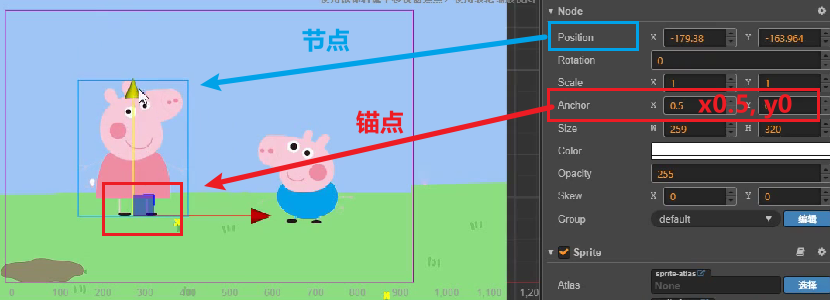
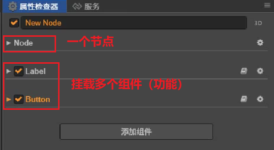
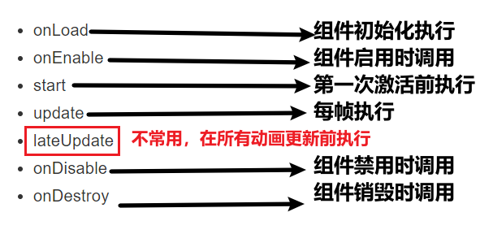
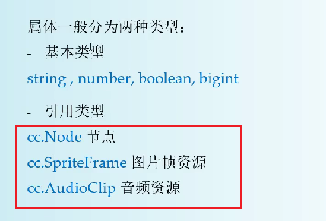
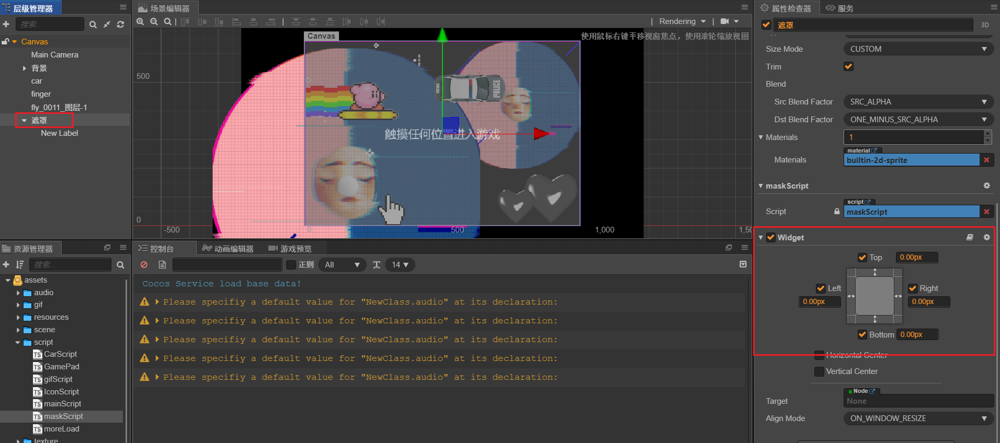
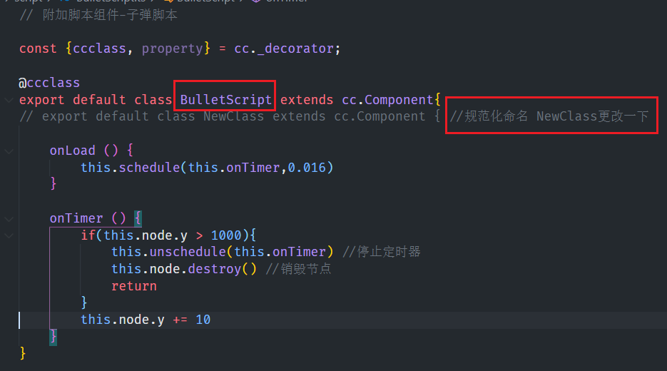

# canvas

长久以来，web上的动画是flash,缺点需要安装Adobe Flash Player,漏洞多，重量大，卡顿和不流畅

canvas是一个轻量级画布，使用canvas进行Javascript的编程，不卡顿

### 1.1 Hello World

在页面中设置一个canvas标签

```html
<canvas width="600" height="300">
    当前的浏览器版本不支持，请升级浏览器(高版本浏览器不显示这行字)
</canvas>
```

canvas的标签属性只有两个，width和height

`注：以上两个属性不能用css样式设置 画布会失帧`

script1标签中绘制矩形

```js
 var canvas = document.getElementById('myCanvas')

// 得到画布的上下文，2D和3D
var ctx = canvas.getContext('2d')
console.log( ctx );//所有的图像绘制都是通过ctx的属性和方法绘制，和canvas标签无关

// 绘制矩形,得先设置颜色 不然不生效
ctx.fillStyle='green'
ctx.fillRect(100,100,200,50)
```

通过以上代码，需要知道重要的API

> 获取上下文：var ctx = canvas.getContext( )
>
> 设置颜色：ctx.fillStyle
>
> 绘制矩形： ctx.fillRect(x,y,c,d)，xy表示位置，cd表宽高

canvas本质上利用代码在浏览器的页面上画画


### 1.2 canvas的像素化

用canvas绘制一个图形，一旦绘制成功，就像素化，无法修改已经在画布上的内容。这也是其轻量化原因（不同于flash）

让canvas图像移动，要按清屏-更新-渲染的逻辑进行编程


### 1.3 canvas的动画思想

面向对象的动画 都是清屏-更新-渲染的逻辑

```js
// 获取画布
var canvas = document.getElementById('myCanvas')
// 获取上下文并设置颜色和信号量
var ctx = canvas.getContext('2d')
ctx.fillStyle = 'plum'
var left = 100
// 动画过程
setInterval(function(){
  // 清除画布，前两位参数从什么位置开始清除，后两位参数是清除的宽度和高度
  ctx.clearRect(0,0,600,600)
  left++ // 更新信号量
  ctx.fillRect(left,100,100,100) //重新绘制，canvas画布上的元素被像素化了，不能通过style.left方法修改，
},10)
```

实际上，动画的生成，就是静态画面连续播放 以上用了定时器

将每次绘制的静态画面叫 `一帧`，时间的间隔就是定时器的间隔`帧的间隔`


### 1.4 面向对象思维的实现

canvas无法获取已上屏的对象，所以需要维持对象的状态。

在canvas动画中，使用面向对象的方式维护canvas所需的状态


# cocoscreator 2D

### 概叙

开发平台 cocosCreator2.4.2 + 开发语言 JS/TS,2D小游戏开发

### 场景与节点

1. 场景 scene: 每一个网格是100像素，x轴向右和y轴向上为正

2. 位置position:用于指定一个节点的位置，锚点Anchor:定义一个代表节点位置的点 

  
3. position是相对坐标 相对于父节点

### 节点与组件

1. 节点Node,可添加图片(Sprite)、文本(Label)、UI节点

2. 组件Component,表示一个功能，一个节点可以挂载多个组件（渲染类组件只能挂载一个,如label和sprite不能同时挂载）

  

3. 节点本身没有类型，真正起作用的是组件，如图片组件 = Node+Sprite

4. 父子节点关系：随之移动、旋转、缩放；子节点的位置是相对于父节点

### 游戏的脚本

1. cocos中只支持可读，编辑脚本需双击在vsCode中

2. 脚本运行的原理：游戏引擎加载所有的节点和节点中所有的组件

3. 脚本的生命周期回调：

   

4. 事件响应处理
  ```jsx
  mousedown/mouseup/mousemove ……//点击事件

  keyup/keydown …… //键盘事件

  touchstart/touchend/touchcancel……//触摸事件

  this.node.on('mousedown',this.自定义函数,this)
  ```

### TypeScript

1. 强类型的语言更适合脚本的开发
  ```js
  let str:string = 'word'
  let node:cc.Node = this.node //cc.Node是文档API中定义的类型

  sum(x:number,y:number):number{
    return x+y
  } //ts的返回值
  ```
2. 属性的定义
  ```js
  @property(cc.Label)
    label:cc.Label = null //如果不写@property cocos中就不会显示定义的属性label

    text:string = 'hello'//基本类型可以不指明类型 string、number、boolean、bigint
  ```

3. 一个脚本可以重复使用，应用于多个节点；脚本中的属性，可以在cocos属性面板中指定初始值

  

4. 引用类型例子 添加音乐（给人物节点添加移动脚步声、全局音乐）
  ```js
    //1.编写音乐脚本
    const {ccclass, property} = cc._decorator;

    @ccclass
    export default class NewClass extends cc.Component {

        @property(cc.AudioClip)
        audio:cc.AudioClip

        onLoad () {
            if(this.audio != null)
                cc.audioEngine.play(this.audio,false,1)
        }
    }
    //2.cocos属性面板中 指定一个音频文件 拖动到audio中，最后运行游戏
  ```

### 节点相关的API

1. API获取节点

  ```js
  this.node = cc.Node // 当前节点
  let node:cc.Node = this.node

  this.node.parent // 父节点
  this.node.children:cc.Node[]//子节点

  target = cc.find('Canvas/佩奇')//全局查找 52.4 51.8 
  target = cc.find('xx/yy',someNode) //查找子节点

  ```
2. API获取组件
  ```js
  let label = node.getComponent(cc.Label) //获取组件
  let script = node.getComponent('自定义组件') //获取自定义节点
  ```
3. 脚本组件的访问
  ```js
  onLoad(){
    this.node.on('mousedown',this.onClicked,this)
  }
  onClicked(){
    let targetNode:cc.Node = cc.find('Canvas/佩奇') //获取名字节点
    let script = targetNode.getComponent('simpleScript') //获取节点中的脚本组件
    script.onChange() //调用脚本组件的方法
  }
  ```
  `以上的基槽都在NewProject1中`

### 案例-行走的蜡笔小新

`NewProject2`此游戏的功能细节：
  1. 鼠标事件响应：用两个按钮 控制角色的左右移动
  2. 键盘事件响应：点箭头键 也可以控制角色的移动
  3. 状态切换：左移角色脸朝左，反之变
  4. 伴随音效：左右移动伴有脚步声的音效

    ```js
    const {ccclass, property} = cc._decorator;
    @ccclass
    export default class NewClass extends cc.Component{
      @property
      faceLeft:boolean = true//会在cocos中展示勾选
      
      @property(cc.SpriteFrame)
      face1:cc.SpriteFrame = null

      @property(cc.SpriteFrame)
      face2:cc.SpriteFrame = null

      @property(cc.AudioClip)
      audio:cc.AudioClip 

      onLoad(){
        cc.systemEvent.on('keydown',this.onKeyDown,this)
      }
      onKeyDown(evt:cc.Event.EventKeyboard){
        if(evt.keyCode == cc.macro.KEY.left){
            this.moveLeft()
        }else if
            (evt.keyCode == cc.macro.KEY.right)
        {
            this.moveRight()
        }
      }
      moveLeft(){
        if(!this.faceLeft){
          this.faceLeft = true
          this.changeFace()
        }
        this.move()
      }
      moveRight(){
        if(this.faceLeft){
          this.faceLeft = false
          this.changeFace()
        }
        this.move()
      }
      // 改变脸的朝向
      move(){
        if(this.faceLeft){
           this.node.x -= 10
        }else{
           this.node.x += 10
        }
        if(this.audio != null){
           cc.audioEngine.play(this.audio,false,1)
        }
      }
      changeFace(){
        let sprite:cc.Sprite = this.node.getComponent(cc.Sprite)
        if(this.faceLeft)
           sprite.spriteFrame = this.face1
        else
          sprite.spriteFrame = this.face2
       }
    }
    ```


### 缓动系统

1. 坐标系
  ```js
  <!-- 坐标用 Vec2或Vec3表示，Vector向量 -->
  //Vec2二维坐标（x,y）
  pos = new cc.Vec2(100,100)
  pos = cc.v2(100,100)

  //Vec3 三维坐标（x,y,z）
  pos = new cc.Vec3(100,100,0)
  pos = cc

  //取得一个节点的坐标
  let pos:cc.Vec2 = node.getPosition()

  <!-- 设置一个节点的坐标，这是直接移动 区别于缓动 -->
  node.setPosition(cc.v2(250,-120))
  node.setPosition(cc.v3(250,-120,0))

  //设置一个节点的缩放（目标游戏是2D 故Z轴方向的值设为0即可）
  node.setScale(cc.v3(1,1,0))
  ```
2. 缓动系统
  > 除了缓动系统（缓慢地动，呈现渐动效果），还有物理系统、碰撞系统、粒子系统（3D中）

  ```js
  <!-- 连续动作：先位移后旋转 -->
  cc.tween(node)
    .to(1,{position:cc.v3(250,-120,0)})
    .to(1,{rotation:360})
    .start()

  <!-- 并发动作：位移、旋转同时进行 -->
  cc.tween(node)
    .to(1,{position:cc.v3(250,-120,0),rotation:360})
    .start()
  ```
3. cc.tween
  ```js
  <!-- 注意区分by和to -->
  cc.tween(node).to(...).start() //对属性进行绝对值计算 传入最终值
  cc.tween(node).by(...).start() //对属性进行相对值计算 传入改变值

  <!-- 变速easing -->
  cc.tween(node).to(duration,props,easing)//默认从A到B点状态是匀速改变的

  cc.tween(node)
    .by(1,{position:cc.v3(...),{easing:'quadOut'}})
    .start() //速度越来越慢，速度是时间的平方
  ```
4. 拍球案例（`NewProject2`）

### 动画-移动的小葵
> 让游戏中的物体动起来 比cc.tween要高级

1. 动画

  帧动画的特点：每帧之间的变化较小、帧率高 快到人眼无法区分

  帧动画不是连续的，每帧之前有**16毫秒**的间隔。但人类大脑无法区分，大脑会认为画面是连续的。

  ```js
  <!-- 添加一个脚本组件,update会被游戏引擎每秒调用60次，即帧率FPS=60 -->
  update(dt){
    if(this.node.x>=200) return 
    this.node.x += 5 //将节点移动5像素
  }
  ```

2. 帧率（frams per second）

   实际指**update()的调用频率**，若update()中没有变化，则游戏画面是不会重绘的。

   `注意`帧率是一个全局设置，所以最好在游戏初始化脚本中设置。建一个GameInitScript,挂载Canvas节点下

    ```js
    //游戏的默认FPS = 60
    update(dt){...}
    <!-- 其中，dt(delta time)指上一帧的时间间隔，一般dt约为 0.016 秒，但并不是一个精确数字，或长或短 -->

    cc.game.setFrameRate(30)
    <!-- 帧率越高，操作系统的负载就越大，可在全局中设置降低帧率 -->
    ```

3. 状态控制

  `演示NewProject2中的小葵`：使用上下左右键实现节点移动，空格键原地不动

  ```jsx
  const {ccclass, property} = cc._decorator;
  @ccclass
  export default class NewClass extends cc.Component {
    //1.添加节点的运动状态
    speed:number = 3 //速度 每次移动3个像素
    direction:cc.Vec2 = null // 方向 如水平向右（1,0）  竖直向下（0，-1）

    onLoad () {
        cc.systemEvent.on('keydown',this.onKeyPress,this)
    }
    //2.添加按键的响应：按下相应键 改变运动状态
    onKeyPress(e:cc.Event.EventKeyboard){
        if(e.keyCode == cc.macro.KEY.a)
            this.direction = cc.v2(-1,0)
        else if(e.keyCode == cc.macro.KEY.d)
            this.direction = cc.v2(1,0)
        else if(e.keyCode == cc.macro.KEY.w)
            this.direction = cc.v2(0,1)
        else if(e.keyCode == cc.macro.KEY.s)
            this.direction = cc.v2(0,-1)
        else if(e.keyCode == cc.macro.KEY.space)
            this.direction = null
    }
    //3.根据当前的运行状态 更新节点的位置 实现update
    update(dt) {
        if(this.direction == null) return //原地不动

        let pos:cc.Vec2 = this.node.getPosition()
        pos.x += this.speed * this.direction.x
        pos.y += this.speed * this.direction.y

        this.node.setPosition(pos)
    }
  }
  <!--direction的方向表示 以后常用;目前尚未添加边界控制，以后可在边界添加障碍物-->
  ```

4. 计时器API
  cocos提供一套计时器API,封装在cc.Component中

  `NewProject2-开始游戏字体案例`

  ```js
  // 启动定时器
  comp.schedule(callback,interval)

  //完整调用 可以传4个参数
  comp.schedule(callback,interval,repeat,delay)

  <!-- callback-计时器回调
       interval-每次时间间隔
       repeat-重复多少次
       delay-多少秒还时启动
   -->

  //停止定时器 
  comp.unschedule(callback)
  ```
### 手柄控制器
  `NewProject3-小车的运动和方向被手柄控制`

### GIF在cocos中的显示
  `NewProject3-蒸汽波炫酷背景`
  1. PS cc2019将gif图片的每一帧导出文件为png格式， 将所有图片添加到项目

  2. 对每张图片逐一设置，cocos中属性Sprite，把trim type设置为none

  3. 用一个脚本来循环显示图片

     ```js
     // gif图片如何在cocos中显示

     const {ccclass, property} = cc._decorator;

     @ccclass
     export default class NewClass extends cc.Component {

        @property([cc.SpriteFrame])
        frames:cc.SpriteFrame[] = []

        sprite:cc.Sprite = null //Sprite组件
        index:number = 0 // 当前显示第n张图片
        interval:number = 0.1 //定时器的间隔

        protected onLoad(): void {
            this.sprite = this.getComponent(cc.Sprite)
        }

        protected start(): void {
            this.schedule(this.onTimer,this.interval)
        }

        onTimer(){
            if(this.frames.length == 0) return

            this.sprite.spriteFrame = this.frames[this.index]
             
            //下一帧
            this.index++
            if(this.index >= this.frames.length)
                 this.index = 0
        }

        protected onDestroy(): void {
            this.unschedule(this.onTimer)
        }
     }
     ```

  4. 在属性面板中，指定要显示的图片数组并拖拽


### 图集Atlas

[官方文档]: https://docs.cocos.com/creator/manual/zh/asset/atlas.html	"类似雪碧图"


### 资源的动态加载
  1. 资源加载有两种方式，静态加载直接在属性管理器指定，节点加载时一并加载

  2. 动态加载 使用`cc.resources.load()`运行
    ```jsx
    //点击图片时 动态加载一张图片显示 点击小手变爱心
    onClicked(){
        let self = this //闭包语法

        // 'icon/love'待加载的资源必须放在resources目录下，路径不能带后缀名
        cc.resources.load('icon/love',cc.SpriteFrame,function(err,assets){
           if(err) { cc.log(err);return}
           /* cc.log(this.node,'this')
           cc.log(self.node,'self') */

           // 为什么用self不用this 因为回调中无法直接调用this 所以先定义
           self.node.getComponent(cc.Sprite).spriteFrame = <cc.SpriteFrame> assets //<cc.SpriteFrame>类型转化
        })

      }
    }
    ```
  3. 动态加载多个资源
    `详见NewProject3/moreLoad.ts`
    ```jsx
    //指定多个资源路径：paths类型cc.String,assets类型cc.Asset
    cc.resources.load(paths,callback(err,assets){...})

    //指定一个资源目录： path是文件夹路径，assets类型是cc.Asset
    cc.resources.loadDir(path,callback(err,assets){...})
    ```
### 事件的冒泡
1. 触摸事件

  触摸事件：touchstart、touchmove、touchend、touchcancel

  鼠标事件：mousedown、mousemove、mouseup、mousewheel、mouseenter、mouseleava

  教程中，`统一使用触摸事件`

2. 事件冒泡机制

    Event Bubbles事件冒泡，与网页开发的冒泡机制相同（`特指触摸事件 不适用鼠标事件`）

    同级节点不会接收到touchstart事件

    即使子节点在父节点区域之外，事件也会传递给父节点

    `e.stopPropagation()`可以阻止事件的传递  

3. 遮罩效果案例

   `NewProject3遮罩层`

   这里会用到 Widget组件，用于辅助定位，添加此组件，将上下左右边距设为0
   

4. 游戏提示框案例
  ```js
  onLoad(){
    this.node.on('touchstart',this.onTouch,this)
  }
  onTouch(){
    //隐藏对话框
    let node:cc.Node = cc.find('Canvas/提示框')
    node.active = false
  }
  ```

5. Block Input Events
  cocos中自带的组件，用于阻止输入事件
  ```js
  onLoad(){
    this.node.on('touchstart',this.stopEvents,this)
    this.node.on('touchmove',this.stopEvents,this)
    this.node.on('touchend',this.stopEvents,this)
    this.node.on('touchcancel',this.stopEvents,this)
  }
  stopEvents(e:cc.Event){
    e.stopPropagation()
  }
  ```

### 发射子弹
`NewProject4`
1. 发射子弹
  模拟子弹发射的效果，炮塔、发射、爆炸

2. 动态创建节点

  游戏中有的节点是动态创建的，如子弹节点 只有在发射的时候才创建

3. 附加脚本组件

  动态创建的节点，也可以附件脚本组件：

  新建脚本并附加到节点 `let comp = node.addComponent(类名)`

  注意 : 脚本类名规范化，因为需要在别的类中引入

  

  将以上脚本引入到需要的组件中：

  ```js
  import BulletScript from './BulletScript'
  .....
  let script = node.addComponent(BulletScript)
  ```
4. 爆炸效果

  在子弹节点结束之前，实现一个爆炸效果（爆炸图片替换子弹的 爆炸动态利用缓动效果）

  在需要挂载的组件中传入爆炸图片

  